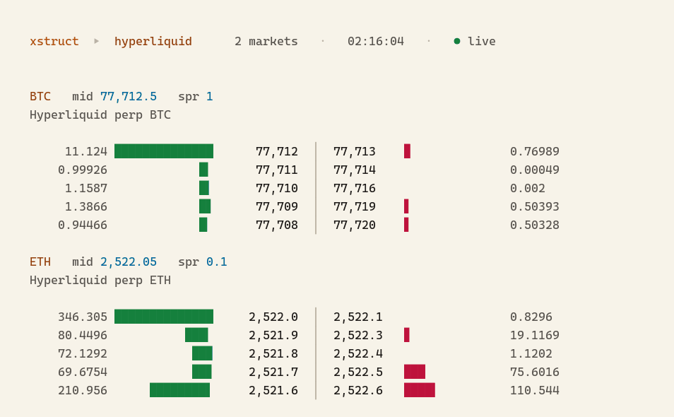
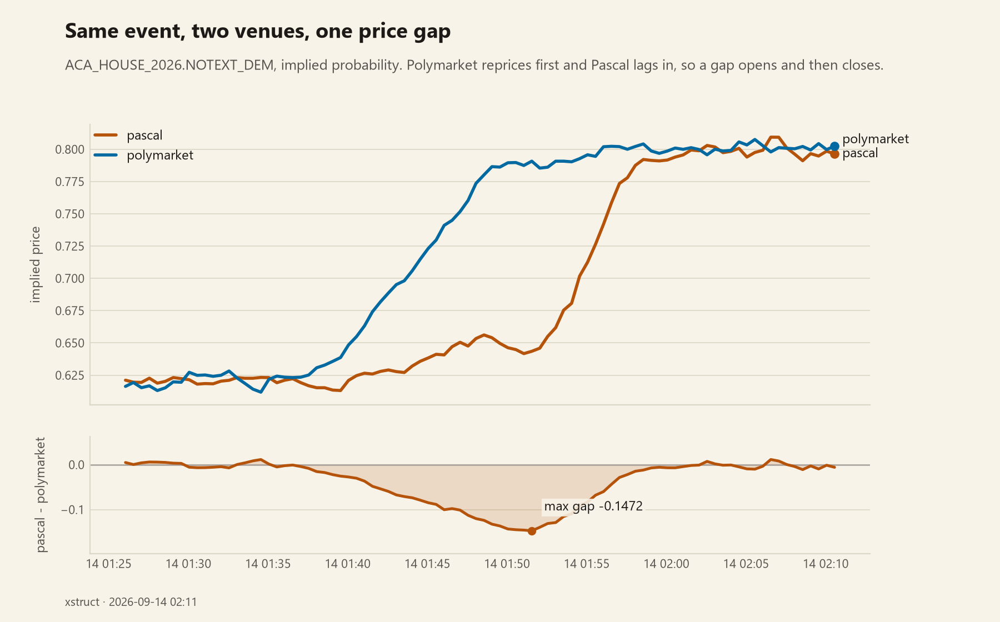

# xstruct

**A venue-agnostic market-making and microstructure toolkit for prediction markets and derivatives order books.**

Every venue publishes its book in a different shape. xstruct puts them behind one interface, so the same
analysis and the same strategy code run against any of them without caring whose API is underneath.



The depth ladder, polling Hyperliquid. Bid and ask bars share one scale, so a lopsided
book looks lopsided.



Two venues listing the same event, and the gap between them. Pascal republishes the Polymarket
`condition_id`, so the books line up on a known key instead of fuzzy-matching market names.

```bash
pip install -r requirements.txt
python -m xstruct.monitor.live          # live cross-venue dislocation scan
python -m xstruct.cli --venue pascal    # live depth-ladder board
```

## What it does today

**Four venues behind one `Venue` interface** — Hyperliquid (perps), Pascal, Polymarket, and a synthetic
paper adapter so everything runs offline for demos and CI. Adding a venue is one file, not a refactor.

**A live cross-venue monitor.** Pascal publishes the Polymarket `condition_id` and outcome `token_id` for
each of its markets, so the two books join on a known key instead of fuzzy-matching market names. A real
run on the ACA House 2026 market:

```
  Not extended, Democrats
           pascal   bid 0.8440   ask 0.8700   mid 0.8570
       polymarket   bid 0.8500   ask 0.8700   mid 0.8600
      dislocation   0.0030
```

It reports the mid dislocation across venues and flags any locked cross-venue edge (a best bid above
another venue's best ask, net of fees).

**A terminal depth ladder**, with size bars, tick-aware price precision, and an ASCII fallback for
consoles that cannot encode block glyphs.

**A SQLite tick store** recording books and trades for later microstructure work, and a chart renderer
that turns a recorded pair into a shareable dislocation figure.

## One thing worth knowing if you build venue adapters

Polymarket returns asks **descending**, so the first element on the wire is the *worst* ask, not the best.
Trusting wire order gives you a best ask of 0.99 instead of the real one, and silently poisons every
spread, mid and arbitrage check downstream. xstruct sorts both sides itself rather than trusting order.
Pascal returns bids descending and asks ascending. Hyperliquid nests both under `levels: [bids, asks]`.

## Known limits, stated plainly

- **Transport is REST polling.** No WebSocket, no snapshot-plus-delta book maintenance. Fine for
  microstructure sampling and cross-venue comparison, not a low-latency path.
- **Read path only.** No signing, no order placement, no market-making engine yet.
- Adapters today are Hyperliquid, Pascal, Polymarket and paper. No Kalshi.

## Layout

```
xstruct/
  venue/      one adapter per venue, all behind the Venue interface
  collect/    SQLite tick store
  monitor/    cross-venue mispricing scan
  render/     terminal board
  report/     charts
```

## Tests

```bash
pytest -q     # 28 tests, all offline (network calls are injectable)
```

## Roadmap

Signed write paths (Pascal Ed25519, Hyperliquid SDK), then the market-making engine with inventory skew
and a resolution-proximity kill, then more adapters (Kalshi next).

## License

MIT
